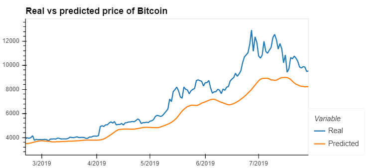
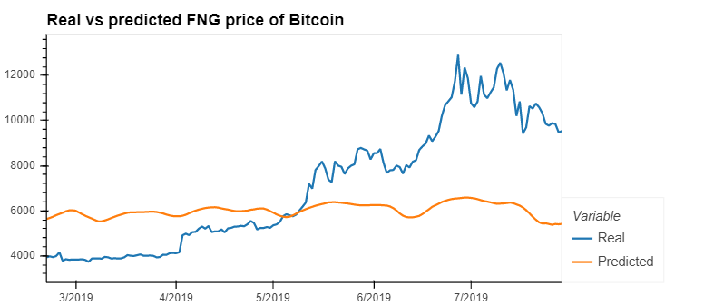
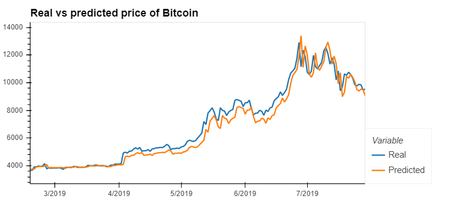
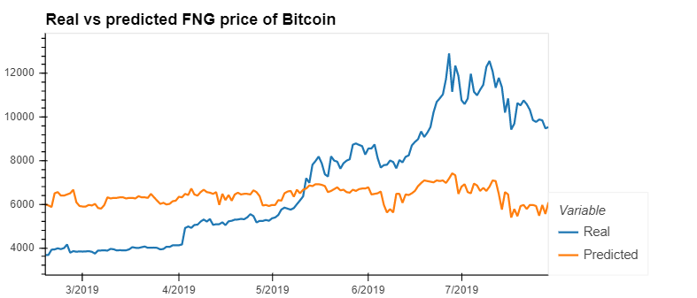

# LSTM Stock Predictor


Due to the volatility of cryptocurrency speculation, investors will often try to incorporate sentiment from social media and news articles to help guide their trading strategies. One such indicator is the [Crypto Fear and Greed Index (FNG)](https://alternative.me/crypto/fear-and-greed-index/) which attempts to use a variety of data sources to produce a daily FNG value for cryptocurrency. We have been asked to help build and evaluate deep learning models using both the FNG values and simple closing prices to determine if the FNG indicator provides a better signal for cryptocurrencies than the normal closing price data.

Using the deep learning recurrent neural networks, we can model bitcoin closing prices. One model will use the FNG indicators to predict the closing price while the second model will use a window of closing prices to predict the nth closing price.

We will need to:

1. [Prepare the data for training and testing](#prepare-the-data-for-training-and-testing)
2. [Build and train custom LSTM RNNs](#build-and-train-custom-lstm-rnns)
3. [Evaluate the performance of each model](#evaluate-the-performance-of-each-model)

- - -

### Files

[Closing Prices Starter Notebook](Starter_Code/lstm_stock_predictor_closing.ipynb)

[FNG Starter Notebook](Starter_Code/lstm_stock_predictor_fng.ipynb)

- - -

## Instructions

### Prepare the data for training and testing

* Use the starter code as a guide to create a Jupyter Notebook for each RNN. The starter code contains a function to create the window of time for the data in each dataset.

* For the Fear and Greed model, we will use the FNG values to try and predict the closing price. A function is provided in the notebook to help with this.

* For the closing price model, we will use previous closing prices to try and predict the next closing price. A function is provided in the notebook to help with this.


* Each model will need to use 70% of the data for training and 30% of the data for testing.

```python
    # Predict Closing Prices using a 1 to 10 day window of previous closing prices
    window = 1
    # Column index 0 is the 'fng_value' column and the Column index 1 is the `Close` column
    feature_column = 1
    target_column = 1
    X, y = window_data(df, window, feature_column, target_column)
```

* Apply a MinMaxScaler to the X and y values to scale the data for the model.

```python
    # Use MinMaxScaler to scale the data between 0 and 1. Importing the MinMaxScaler from sklearn
    from sklearn.preprocessing import MinMaxScaler
    # Create a MinMaxScaler object
    scaler = MinMaxScaler()
    # Fit the MinMaxScaler object with the features data X
    scaler.fit(X)
    # Scale the features training and testing sets
    X_train_scaled = scaler.transform(X_train)
    X_test_scaled = scaler.transform(X_test)
    # Fit the MinMaxScaler object with the target data Y
    scaler.fit(y)
    # Scale the target training and testing sets
    y_train_scaled = scaler.transform(y_train)
    y_test_scaled = scaler.transform(y_test)
```

* Finally, reshape the X_train and X_test values to fit the model's requirement of samples, time steps, and features. (*example:* `X_train = X_train.reshape((X_train.shape[0], X_train.shape[1], 1))`)

```python
    # Reshape the features for the model
    X_train_reshaped = X_train_scaled.reshape((X_train_scaled.shape[0], X_train_scaled.shape[1], 1))
    X_test_reshaped = X_test_scaled.reshape((X_test_scaled.shape[0], X_test_scaled.shape[1], 1))
```

### Build and train custom LSTM RNNs

In each Jupyter Notebook, create the same custom LSTM RNN architecture. In one notebook, we will fit the data using the FNG values. In the second notebook, we will fit the data using only closing prices.

Use the same parameters and training steps for each model. This is necessary to compare each model accurately.

1. Import the required library from tensorflow</br>
    
```python
    from tensorflow.keras.models import Sequential
    from tensorflow.keras.layers import LSTM, Dense, Dropout
```
2. Define the model architecture</br>
   
```python
    # Build the LSTM model. 
    """
    The return sequences need to be set to True if you are adding additional LSTM layers, but 
    you don't have to do this for the final layer.
    The dropouts help prevent overfitting
    The input shape is the number of time steps and the number of indicators
    Batching inputs has a different input shape of Samples/TimeSteps/Features
    """
    model = Sequential()

    number_units = 30
    dropout_fraction = 0.2

    # Layer 1
    model.add (LSTM (units= number_units, return_sequences= True, input_shape= (X_train_reshaped.shape[1], 1)))
    model.add (Dropout (dropout_fraction))

    # Layer 2 
    model.add (LSTM (units= number_units, return_sequences= True))
    model.add (Dropout (dropout_fraction))

    # Layer 3
    model.add (LSTM (units = number_units))
    model.add (Dropout (dropout_fraction))

    # Output layer
    model.add (Dense (units = 1))
```
3. Compile the model</br>
   
```python
    model.compile(loss = 'mean_squared_error', optimizer = 'adam')
```
4. Fit the model and train the data</br>

```python
    # Train the model
    # Use at least 10 epochs
    # Do not shuffle the data
    # Experiement with the batch size, but a smaller batch size is recommended
    # Add verbose of >1 to show more details about the training data
    model.fit(X_train_reshaped, y_train_scaled, epochs = 10, batch_size = 5, shuffle = False)
```  
    
 | Closing Price with 10-day Window    | FNG with 10-day window              |
 | ----------------------------------- | ----------------------------------- |
 |   |   |
 
 | Closing Price with 1-day Window    | FNG with 1-day window                |
 | ----------------------------------- | ----------------------------------- |
 |   |   |
 

### Evaluate the performance of each model

Finally, use the testing data to evaluate each model and compare the performance.

Use the above to answer the following:

> Which model has a lower loss?
> ```python
> LSTM with Closing Price
> ``` 
> Which model tracks the actual values better over time?
> ```python
> LSTM with Closing Price
> ```
> Which window size works best for the model?
> ```python
> window = 1
> ```
- - -

### Resources

[Keras Sequential Model Guide](https://keras.io/getting-started/sequential-model-guide/)

[Illustrated Guide to LSTMs](https://towardsdatascience.com/illustrated-guide-to-lstms-and-gru-s-a-step-by-step-explanation-44e9eb85bf21)

[Stanford's RNN Cheatsheet](https://stanford.edu/~shervine/teaching/cs-230/cheatsheet-recurrent-neural-networks)

- - -

### Hints and Considerations

Experiment with the model architecture and parameters to see which provides the best results, but be sure to use the same architecture and parameters when comparing each model.

For training, use at least 10 estimators for both models.

- - -

© 2019 Trilogy Education Services, a 2U, Inc. brand. All Rights Reserved.
